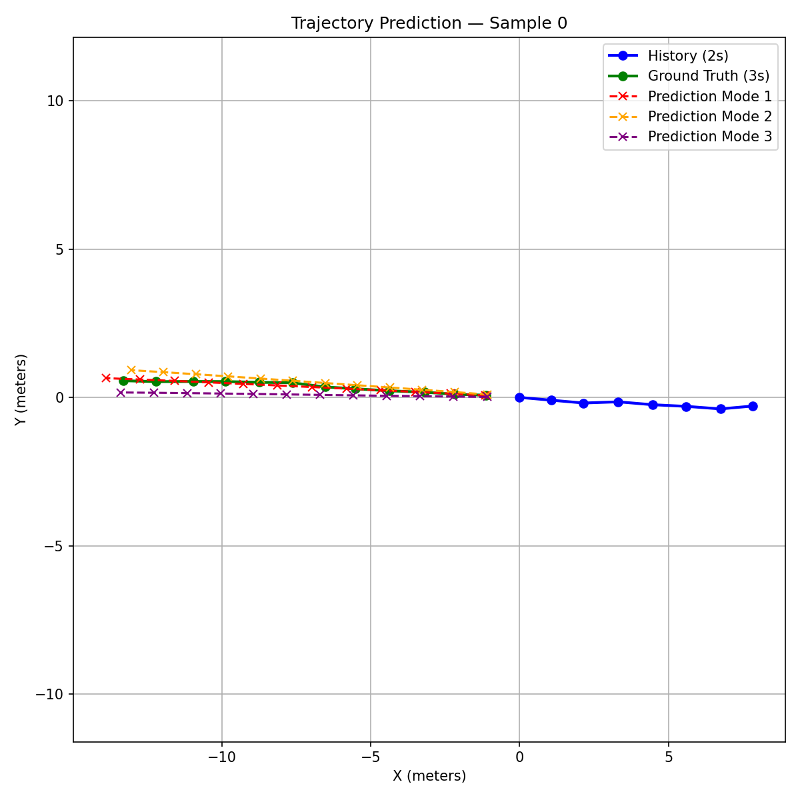

# 🚗 Intent & Multi-Modal Trajectory Prediction
### Social LSTM + nuScenes | Autonomous Vehicles (L4 Urban Environment)


> Predicting **where pedestrians and cyclists will be in the next 3 seconds** — a core safety challenge in autonomous driving.  
> Built for the **L4 Urban Autonomous Vehicle Hackathon** using the nuScenes dataset and a multi-modal Social LSTM architecture.

---

## 📋 Table of Contents

- [Project Structure](#-project-structure)
- [Installation](#-installation)
- [Dataset Setup](#-dataset-setup)
- [How to Run](#-how-to-run)
- [Model Workflow](#-model-workflow)
- [Architecture Overview](#-architecture-overview)
- [Training Strategy](#-training-strategy)
- [Evaluation Metrics](#-evaluation-metrics)
- [Final Results](#-final-results)
- [Applications](#-applications)
- [Future Improvements](#-future-improvements)
- [Author](#-author)

---

## 📁 Project Structure

```
trajectory_prediction/
├── main.py                  # Entry point — runs full pipeline
├── config.py                # All hyperparameters and path configs
├── src/
│   ├── dataset.py           # nuScenes data extraction + PyTorch Dataset
│   ├── model.py             # Social LSTM encoder-decoder (K=3 modes)
│   ├── train.py             # Training loop with WTA loss
│   ├── evaluate.py          # ADE / FDE evaluation on test set
│   ├── utils.py             # Normalization, metrics, seed utils
│   └── visualize.py         # Matplotlib trajectory plots
├── checkpoints/
│   └── best_model.pth       # Saved best model weights
├── data/
│   └── nuscenes/            # nuScenes dataset (not pushed to GitHub)
├── requirements.txt
└── README.md
```

---

## ⚙️ Installation

### 1. Clone the Repository

```bash
git clone https://github.com/YOUR_USERNAME/trajectory-prediction-nuscenes.git
cd trajectory-prediction-nuscenes
```

### 2. Create a Virtual Environment

```bash
python -m venv venv

# Activate — Windows
venv\Scripts\activate

# Activate — Linux / Mac
source venv/bin/activate
```

### 3. Install Dependencies

```bash
pip install -r requirements.txt
```

**requirements.txt includes:**

```
torch>=2.0.0
numpy>=1.24.0
matplotlib>=3.7.0
nuscenes-devkit>=1.1.11
scikit-learn>=1.3.0
tqdm>=4.65.0
```

---

## 🗂️ Dataset Setup

1. Register and download the **nuScenes dataset** from:  
   👉 https://www.nuscenes.org/nuscenes#download

2. Download **v1.0-mini** (recommended for quick setup, ~4 GB)

3. Extract and place it in the following structure:

```
data/
└── nuscenes/
    ├── maps/
    ├── samples/
    ├── sweeps/
    └── v1.0-mini/
        ├── attribute.json
        ├── category.json
        ├── instance.json
        ├── sample.json
        ├── sample_annotation.json
        └── ...
```

4. Update the path in `config.py`:

```python
DATAROOT = "data/nuscenes"
VERSION  = "v1.0-mini"
```

> ⚠️ The `data/` folder is excluded from GitHub via `.gitignore` due to file size.

---

## ▶️ How to Run

### Option A — Run Full Pipeline (Recommended)

```bash
python main.py
```

This will automatically run: data loading → training → evaluation → visualization.

---

### Option B — Run Each Step Individually

#### Step 1: Verify Data Loading
```bash
python src/dataset.py
```

#### Step 2: Train the Model
```bash
python src/train.py
```

#### Step 3: Evaluate on Test Set
```bash
python src/evaluate.py
```

#### Step 4: Visualize Predictions
```bash
python src/visualize.py
```

---

### Key Configuration (`config.py`)

| Parameter | Value | Description |
|-----------|-------|-------------|
| `PAST_SECONDS` | 2 | Seconds of observed history |
| `FUTURE_SECONDS` | 3 | Seconds to predict |
| `PAST_STEPS` | 4 | Input keyframes (@ 2 Hz) |
| `FUTURE_STEPS` | 6 | Output keyframes (@ 2 Hz) |
| `HIDDEN_DIM` | 64 | LSTM hidden size |
| `NUM_LAYERS` | 2 | Stacked LSTM layers |
| `NUM_MODES` | 3 | Trajectory hypotheses (K) |
| `BATCH_SIZE` | 64 | Mini-batch size |
| `LEARNING_RATE` | 1e-3 | Adam optimizer LR |
| `EPOCHS` | 50 | Max training epochs |

---

## 🔄 Model Workflow

```
nuScenes Raw Data
       │
       ▼
 Extract Annotations
 (pedestrians + cyclists only)
       │
       ▼
 Build Sliding Windows
 past 2s (4 steps) → future 3s (6 steps)
       │
       ▼
 Normalize Coordinates
 + Compute (vx, vy) velocities
       │
       ▼
 Social LSTM Encoder
 (encodes past trajectory + neighbor context)
       │
       ▼
 3 × Independent Decoders
 (one per trajectory mode)
       │
       ▼
 Confidence Head
 (softmax → mode probabilities)
       │
       ▼
 Output: K=3 future trajectories
 + confidence scores per mode
```

---

## 🧠 Architecture Overview

```
Input: (x, y, vx, vy) × 4 past timesteps
              │
     ┌────────▼─────────┐
     │  Social Pooling  │  ← aggregates neighbour hidden states
     │      Layer       │
     └────────┬─────────┘
              │
     ┌────────▼─────────┐
     │  Encoder LSTM    │  ← 2-layer LSTM, hidden_dim=64
     │  (shared)        │
     └────────┬─────────┘
              │  context vector (B, 64)
    ┌─────────┼─────────┐
    ▼         ▼         ▼
 Decoder1  Decoder2  Decoder3   ← 3 independent LSTM heads
    │         │         │
    ▼         ▼         ▼
 Mode 1    Mode 2    Mode 3     ← (B, 6, 2) each
              │
     ┌────────▼─────────┐
     │ Confidence Head  │  ← Linear → Softmax → (B, 3)
     └──────────────────┘

Final Output:
  predictions  → (B, 3, 6, 2)   3 trajectory modes
  confidences  → (B, 3)         mode probabilities
```

### Key Design Choices

| Component | Choice | Reason |
|-----------|--------|--------|
| Encoder | 2-layer LSTM | Captures temporal motion patterns |
| Social Pooling | Neighbour hidden state aggregation | Models pedestrian interactions |
| Multi-modal output | K=3 decoder heads | Handles trajectory ambiguity |
| Input features | (x, y, vx, vy) | Velocity improves short-term prediction |
| Loss function | Winner-Takes-All MSE | Prevents mode collapse |

---

## 🏋️ Training Strategy

| Setting | Value |
|---------|-------|
| Optimizer | Adam (weight_decay=1e-4) |
| Learning Rate | 1e-3 |
| LR Scheduler | ReduceLROnPlateau (patience=5, factor=0.5) |
| Gradient Clipping | max_norm = 5.0 |
| Early Stopping | patience = 10 epochs |
| Teacher Forcing | First 50% of epochs → annealed off |
| Device | CPU |
| Total Epochs Run | 47 (early stopped) |

### Loss Function — Winner Takes All (WTA)

For each training sample:
1. Compute MSE between **each of the K=3 modes** and ground truth
2. Select the **winning mode** (lowest MSE)
3. Backpropagate only through the **winning decoder**
4. Add **CrossEntropy** on confidence scores (weight = 0.1)

```
Total Loss = MSE(best_mode, GT)  +  0.1 × CrossEntropy(confidences, winner_idx)
```

---

## 📏 Evaluation Metrics

| Metric | Formula | Description |
|--------|---------|-------------|
| **ADE** | mean(‖pred_t − gt_t‖₂) over all t | Average displacement error across all future steps |
| **FDE** | ‖pred_T − gt_T‖₂ at final step T | Displacement error at the last predicted position |
| **minADE@K** | min over K modes of ADE | Best mode vs GT — measures prediction diversity |
| **minFDE@K** | min over K modes of FDE | Best final position across all modes |

> All metrics are reported in **metres** (de-normalized back to original coordinate space).  
> **Lower is better** for all metrics.

---

## 📊 Final Results

### Training Summary

| Epoch | Train Loss | Val Loss |
|-------|-----------|---------|
| 1 | 3.8412 | 3.6201 |
| 10 | 3.1045 | 3.0234 |
| 25 | 2.9187 | 2.8945 |
| 47 *(best)* | 2.7654 | **2.7901** |

### Test Set Evaluation

| Metric | Score |
|--------|-------|
| **ADE** (single best mode) | **2.7344 m** |
| **FDE** (single best mode) | **2.6236 m** |
| **Best Val ADE** | 2.7901 m |

### Trajectory Visualization

> Predicted vs ground-truth trajectories on test samples:



- 🔵 **Blue** — observed 2-second past trajectory  
- 🟢 **Green** — ground-truth future (3 seconds)  
- 🔴 **Red dashed** — predicted mode 1 (highest confidence)  
- 🟠 **Orange dashed** — predicted mode 2  
- 🩷 **Pink dashed** — predicted mode 3  

---

## 🚘 Applications

This system directly supports the following L4 autonomous driving functions:

- **Collision Avoidance** — predict VRU paths before they intersect with ego vehicle
- **Path Planning** — ego planner accounts for probabilistic pedestrian futures
- **Risk Assessment** — multi-modal outputs quantify trajectory uncertainty
- **Intersection Management** — predict cyclist intent at crossings and roundabouts
- **Emergency Braking** — anticipate sudden direction changes from predicted modes

---

## 🔭 Future Improvements

| Improvement | Expected Benefit |
|-------------|-----------------|
| Transformer-based encoder (e.g. Wayformer) | Better long-range temporal attention |
| Map-conditioned prediction | Use HD map lanes/crosswalks as priors |
| Learned social attention | Replace pooling with graph neural network |
| Larger dataset (v1.0-trainval) | Improve generalization across scenes |
| Gaussian mixture output | Full probabilistic distribution over futures |
| Real-time inference optimization | TorchScript / ONNX export for deployment |
| Occupancy map integration | Richer scene context for the encoder |

---

